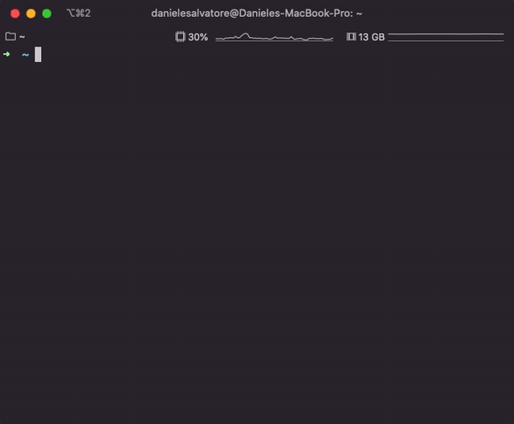

# Get AWS Session Token easily

A simple Node.js command line wizard to generate AWS session tokens for MFA-enabled users.



## Getting started

- Make sure you have the AWS CLI installed
- Backup your `~/.aws/credentials` and `~/.aws/config` files (!!!)
- Make sure you have a valid AWS CLI user configured. Your `~/.aws/credentials` file should contain
  a configuration simlar to the one below. Take note of the profile name (in the example
  `my-nice-profile`), as it will be needed later. If you have only one profile configured, it is
  generally called `default`

```
[my-nice-profile]
aws_access_key_id = XXX
aws_secret_access_key = YYY
```

- Create a file named `config.template` in `~/.aws/` folder, following the example you find below or
  in `config.template` in the project root folder.
- Create a file named `clients.json` in `~/.aws/` folder, following the example you find below or in
  `clients.example.json` in the project root folder, and compile the clients configuration.
- Each client configuration may include the following parameters:

  - `MFASerialNumber`: the ARN of the MFA device associated to your users. This can be found on AWS
    console > IAM > Users > (select your user) > Security credentials tab
  - `OutputProfileName`: the named profile you want to generate. This profile is the one to use to
    interact with AWS APIs
  - `Profile`: (optional) if you want to use a specific AWS named profile to generate the session
    token. This is the name you picked earlier.
  - `Region`: (optional) if you want to use a default AWS region for the given AWS profile
  - `Output`: (optional) specify the output format

  [Configuration and credential file settings AWS doc](https://docs.aws.amazon.com/cli/latest/userguide/cli-configure-files.html)

- Install `Get AWS Session Token` using:

```bash
npm install get-aws-session-token -g
```

- Run `gast` command in the terminal to start the wizard and get your AWS session token!

## `clients.json` file example

```json
{
  "MyClient": {
    "MFASerialNumber": "arn:aws:iam::000:mfa/daniele.salvatore",
    "OutputProfileName": "xxx",
    "Profile": "my-profile (this is optional)"
  },
  "MySecondClient": {
    "MFASerialNumber": "arn:aws:iam::000:mfa/daniele.salvatore",
    "OutputProfileName": "yyy"
  }
}
```

## `config.template` file example

```
[profile my-production]
role_arn = arn:aws:iam::000000000000:role/InfrastructureAdminRole
source_profile = session
region = eu-west-1

[profile my-sandbox]
source_profile = session
region = eu-west-1`
```

## Additional documentation

[AWS CLI named profile AWS doc](https://docs.aws.amazon.com/cli/latest/userguide/cli-configure-profiles.html)

### Disclaimer

THE SOFTWARE IS DISTRIBUTED ON A "AS IS" BASIS, WITHOUT WARRANTIES OR CONDITIONS OF ANY KIND.
